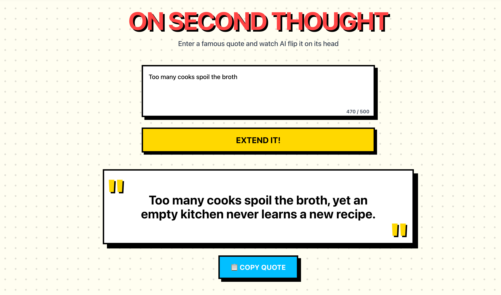
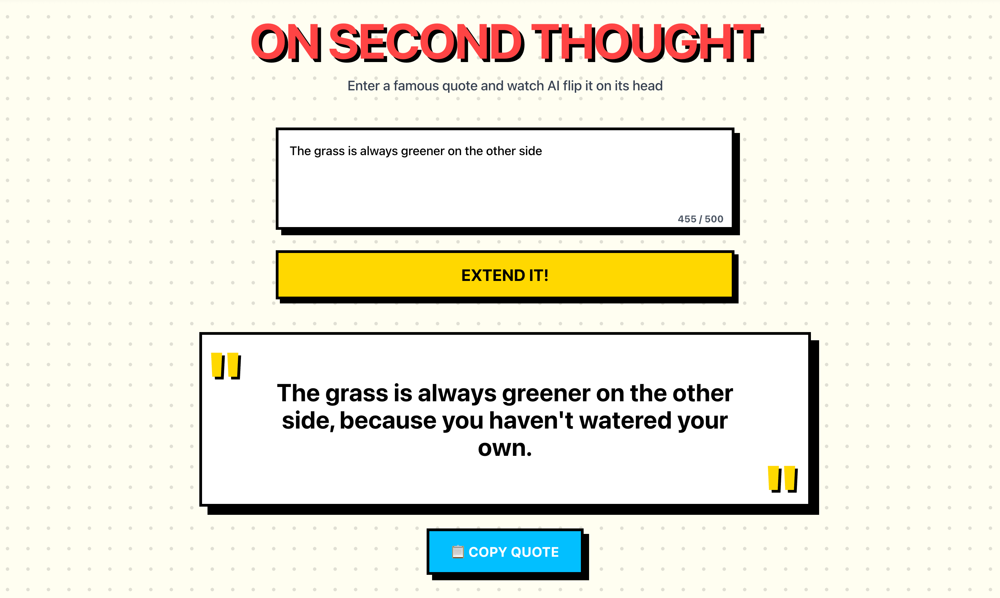
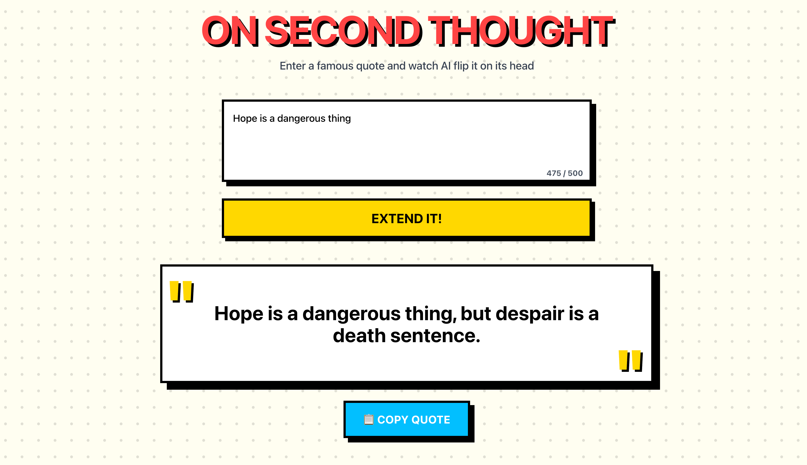

# On Second Thought

A playful web application that takes popular quotes and extends them with AI-generated continuations that flip or contradict the original meaning. Built with Next.js, TypeScript, and Google's Gemini API, featuring a bold comic-book aesthetic.

## Tech Stack

- **Framework**: Next.js 14+ (App Router)
- **Language**: TypeScript
- **Styling**: Tailwind CSS
- **AI**: Google Gemini API
- **Deployment**: Vercel

## Project Structure

```
on-second-thought/
├── app/
│   ├── api/
│   │   └── extend-quote/
│   │       └── route.ts          # API endpoint for quote extension
│   ├── globals.css               # Global styles
│   ├── layout.tsx                # Root layout
│   └── page.tsx                  # Main page component
├── components/
│   ├── ErrorMessage.tsx          # Error display component
│   ├── QuoteDisplay.tsx          # Quote result display
│   └── QuoteInput.tsx            # Quote input form
├── lib/
│   ├── gemini.ts                 # Gemini API service
│   └── rate-limiter.ts           # Rate limiting logic
├── .env.example                  # Environment variable template
├── vercel.json                   # Vercel deployment config
└── next.config.ts                # Next.js configuration
```

## License

This project is licensed under the MIT License - see the [LICENSE](LICENSE) file for details.

## Screenshots







